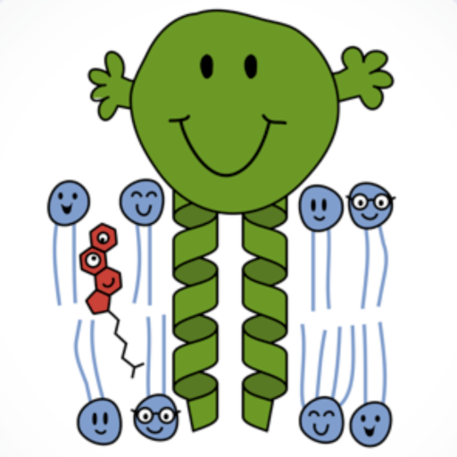

# MemProtMD

  

<b>A selection of Google Colab Workflows for inserting protein structures into membranes</b>

We recomend using Google Chrome or Firefox to run, as Safari has issues with the sizes of a PDB file upload.
The references for each of the methods used in the workflows are cited below. 

<u>[MemProtMD with Insane](https://colab.research.google.com/github/pstansfeld/MemProtMD/blob/main/MemProtMD_Insane.ipynb)</u> - Assembly of a predefined membrane around an input protein structure

<pre>Protein PDB File -> Memembed1 -> martinize2 -> insane3 -> CGMD5 -> CG2AT6 -> Atomistic PDB in membrane</pre>

<u>[MemProtMD with Insane for a Membrane-ony system](https://colab.research.google.com/github/pstansfeld/MemProtMD/blob/main/MemProtMD_Insane_Membrane.ipynb)</u> - Assembly of a predefined membrane 

<pre>insane3 -> CG Membrane5 -> CG2AT6 -> Atomistic membrane</pre>

<u>[MemProtMD Self Assembly](https://colab.research.google.com/github/pstansfeld/MemProtMD/blob/main/MemProtMD_Self_Assembly.ipynb)</u> - Self-Assembly of randomly oriented lipids into a bilayer around an input protein structure

<pre>Protein PDB File -> Memembed1 -> martinize2 -> self-assemble4 -> CGMD5 -> CG2AT6 -> Atomistic PDB in membrane</pre>

<u>[MemProtMD Single Pass TM helix with Insane](https://colab.research.google.com/github/pstansfeld/MemProtMD/blob/main/MemProtMD_Single_Pass_insane.ipynb)</u> - Assembly of a predefined membrane around an input sequence of a single-pass transmembrane helix

<pre>Amino Acid Sequence -> PyMOL -> TM helix PDB File -> Memembed1 -> martinize2 -> insane3 -> CGMD5 -> CG2AT6 -> Atomistic PDB in membrane</pre>

<u>[MemProtMD Single Pass TM helix Self-Assembly](https://colab.research.google.com/github/pstansfeld/MemProtMD/blob/main/MemProtMD_Single_Pass_Self_Assembly.ipynb)</u> - Self-Assembly of randomly oriented lipids into a bilayer around an input sequence of a single-pass transmembrane helix

<pre>Amino Acid Sequence -> PyMOL -> TM helix PDB File -> Memembed1 -> martinize2 -> self-assemble4 -> CGMD5 -> CG2AT6 -> Atomistic PDB in membrane</pre>

<u>[MemProtMD Multimer](https://colab.research.google.com/github/pstansfeld/MemProtMD/blob/main/MemProtMD_multimer.ipynb)</u> - Set-up for Self-Association of 2 membrane protein structures - 1 central 'target' protein and 8 'search' proteins

<pre> 2x PDBs File -> Memembed1 -> martinize2 -> insane3 </pre>

<u>[MemProtMD Association](https://colab.research.google.com/github/pstansfeld/MemProtMD/blob/main/MemProtMD_Association.ipynb)</u> - Set-up for Self-Association of a soluble protein structure with a membrane.

<pre> PDB File -> martinize2 -> insane3 </pre>

<u>[MemProtMD Association with a Membrane Protein](https://colab.research.google.com/github/pstansfeld/MemProtMD/blob/main/MemProtMD_Association_Membrane_Protein.ipynb)</u> - Set-up for Self-Association of a soluble protein structure with a membrane, which contains a membrane protein.

<pre> 2x PDBs File -> Memembed1 -> martinize2 -> insane3 </pre>

<u>[Energy Minimise](https://colab.research.google.com/github/pstansfeld/MemProtMD/blob/main/PDB_fix.ipynb)</u> - Add any missing side-chains and energy minimise a protein structure for use with MemProtMD.

<pre> PDBs File -> PDB2PQR7 -> minimisation5 </pre>

<b>References</b>

1. Nugent & Jones (2013) Membrane protein orientation and refinement using a knowledge-based statistical potential. BMC Bioinformatics. https://doi.org/10.1186/1471-2105-14-276 [https://github.com/psipred/MemEmbed]
2. Souza et al. (2021) Martini 3: a general purpose force field for coarse-grained molecular dynamics. Nature Methods. https://doi.org/10.1038/s41592-021-01098-3 [https://github.com/marrink-lab/vermouth-martinize]
3. Wassenaar et al. (2015) Computational Lipidomics with insane: A Versatile Tool for Generating Custom Membranes for Molecular Simulations. JCTC. https://doi.org/10.1021/acs.jctc.5b00209 [https://github.com/Tsjerk/Insane]
4. Stansfeld et al. (2015) MemProtMD: automated insertion of membrane protein structures into explicit lipid membranes. Structure. https://doi.org/10.1016/j.str.2015.05.006 
5. Abraham et al. (2015) GROMACS: High performance molecular simulations through multi-level parallelism from laptops to supercomputer. SoftwareX. https://doi.org/10.1016/j.softx.2015.06.001
6. Vickery & Stansfeld (2021) CG2AT2: an Enhanced Fragment-Based Approach for Serial Multi-scale Molecular Dynamics Simulations. JCTC. https://doi.org/10.1021/acs.jctc.1c00295 [https://github.com/pstansfeld/cg2at]
7. Jurrus et al. (2018) Improvements to the APBS biomolecular solvation software suite. Protein Science. https://onlinelibrary.wiley.com/doi/10.1002/pro.3280
